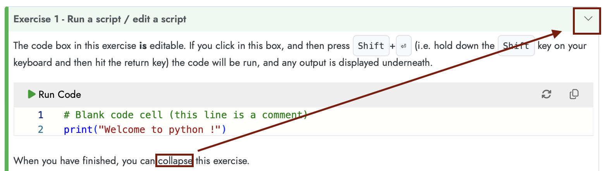

{
  "cells": [
    {
      "cell_type": "raw",
      "metadata": {},
      "source": [
        "---\n",
        "title: Python on the web\n",
        "author:\n",
        "  - Louis Moresi\n",
        "  - Andrew Valentine\n",
        "format:\n",
        "  html:\n",
        "    code-links: false\n",
        "---"
      ]
    },
    {
      "cell_type": "markdown",
      "metadata": {},
      "source": [
        "::: {.callout-note icon=false}\n",
        "# Summary\n",
        "\n",
        "In this section we'll discover how to run a basic python script (in the web browser) and what to expect in terms of editing, reloading, printing output and saving our work. \n",
        ":::\n",
        "\n",
        "There are many different ways to run python code. For the simplest tasks, a web browser is all you need to edit and run simple tasks. In this introductory session, we will use a python interpreter embedded in each web page to learn the basic language itself. \n",
        "\n",
        "You will find examples of python code such as this one which contains some Python code which you can copy but which you can't run and you can't edit. Note that the code is highlighted (coloured) by meaning. "
      ]
    },
    {
      "cell_type": "code",
      "metadata": {},
      "source": [
        "# A simple script (with a descriptive comment)\n",
        "print(\"Welcome to python !\")"
      ],
      "execution_count": null,
      "outputs": []
    },
    {
      "cell_type": "markdown",
      "metadata": {},
      "source": [
        "We use these blocks to give you examples and fragments of code that you can use later. Other code blocks have a `run` button and they can usually be edited (and, don't worry, they can be reset if you make a mistake). We use these **live** code blocks for you to try things out. Give it a go (you can't break anything).\n",
        "\n",
        "```{pyodide-python}\n",
        "# A simple script (with a descriptive comment)\n",
        "print(\"Welcome to python !\")\n",
        "```\n",
        "\n",
        "Generally, we'll use the live code blocks as part of an exercise for you to try something specific. The exercise blocks look like this:\n",
        "\n",
        "::: {.callout-tip collapse=false icon=\"false\"}\n",
        "\n",
        "## Exercise 1 - Run a script / edit a script\n",
        "\n",
        " The code box in this exercise **is** editable. If you click in this box, and then press <kbd>Shift</kbd>+<kbd>⏎</kbd> (i.e. hold down the <kbd>Shift</kbd> key on your keyboard and then hit the return key) the code will be run, and any output is displayed underneath. You can also use the run button if you prefer. \n",
        "\n",
        "```{pyodide-python}\n",
        "# Blank code cell (this line is a comment)\n",
        "print(\"Welcome to python !\")\n",
        "```\n",
        "\n",
        "Note there is a clipboard button to copy your answer and this is quite important because it is not saved anywhere. If you want to keep answers to your exercises, have a separate notebook / editor handy.\n",
        "\n",
        "When you have finished, you can collapse this exercise:\n",
        "\n",
        "{.lightbox width=50% fig-align=center}\n",
        ":::\n",
        "\n",
        "Usually we will collapse the exercises by default and you'll need to open them to access the instructions and the code. \n",
        "We can start right now ... \n",
        "\n",
        "::: {.callout-tip collapse=true icon=\"false\"}\n",
        "\n",
        "## Exercise 2 - Calculations\n",
        "\n",
        "We've already seen a couple of examples of Python code. Now let's try making something from scratch. One thing we can do is simply use Python like a calculator!\n",
        "\n",
        "Try typing simple arithmetic into the code cell below and see what happens. For example, try entering\n",
        "\n",
        "``` python\n",
        "3+17\n",
        "```\n",
        "\n",
        "```{pyodide-python}\n",
        "# Blank\n",
        "\n",
        "\n",
        "```\n",
        "\n",
        "You can also use the operators `*`, `-`, `/` (for division), and the parentheses `()`. Finally, `**` is used to raise a number to some power, so that $3^2$ is entered as `3**2`. Keep trying new calculations !\n",
        "\n",
        "**What happens if you enter two lines of calculations and run ?** For example:\n",
        "\n",
        "``` python\n",
        "3+17\n",
        "5*9\n",
        "```\n",
        "Can you think how to get both of the answers to (hint) print out ?\n",
        "\n",
        ":::\n",
        "\n",
        "\n",
        "### Comments\n",
        "\n",
        "In the examples above, you may have noticed the line\n",
        "\n",
        "``` python\n",
        "# A simple script (with a descriptive comment)\n",
        "\n",
        "```\n",
        "\n",
        "which doesn't look as though it ought to be valid Python code. This is a 'comment' line: the computer ignores the `#` and anything following it on the same line. Comments should be used to document information that helps people to understand how the code works internally. This may seem like a waste of time - but you (or your colleagues) will be grateful in two years' time when you find you need to change something! The comment character can also be useful for 'switching off' lines of code without deleting them. For example, look at this piece of code:\n",
        "\n",
        "``` python\n",
        "def readDataFile(fp):\n",
        "    # This function assumes that fp is\n",
        "    # a valid file-like object and that the\n",
        "    # file has already been opened for reading\n",
        "    header = fp.readline()\n",
        "    # print(header)\n",
        "    [...]\n",
        "```\n",
        "\n",
        "The first three lines of comments provide information recording some of the assumptions the programmer made when writing this function (don't worry if it doesn't make sense yet!). The fourth comment line is a piece of code that has been 'commented out': we don't want to routinely print the file header, but it is useful to be able to reinstate this easily in case we encounter problems and need to check what the function has read.\n",
        "\n",
        "In fact, 'commenting out' code is so common that most editors provide a straightforward way to do it. If you select a block of code and press <kbd>Ctrl</kbd>+<kbd>/</kbd> (or on a Mac, <kbd>⌘</kbd>+<kbd>/</kbd>), the selected lines will all be changed to begin with `#` comment characters. Pressing <kbd>Ctrl</kbd>+<kbd>/</kbd> again will restore the original version. Smart editors know how to do this for many different languages. \n",
        "\n",
        "\n",
        "\n",
        "### Sandbox\n",
        "\n",
        "::: {.callout-warning collapse=\"true\" icon=\"false\"}\n",
        "\n",
        "## Coding scratch space\n",
        "\n",
        "\n",
        "```{pyodide-python}\n",
        "## Scratch space / notepad\n",
        "\n",
        "print(\"Comment out this code with the keyboard shortcut !\")\n",
        "\n",
        "\n",
        "```\n",
        ":::"
      ]
    }
  ],
  "metadata": {
    "kernelspec": {
      "name": "python3",
      "language": "python",
      "display_name": "Python 3 (ipykernel)"
    }
  },
  "nbformat": 4,
  "nbformat_minor": 4
}